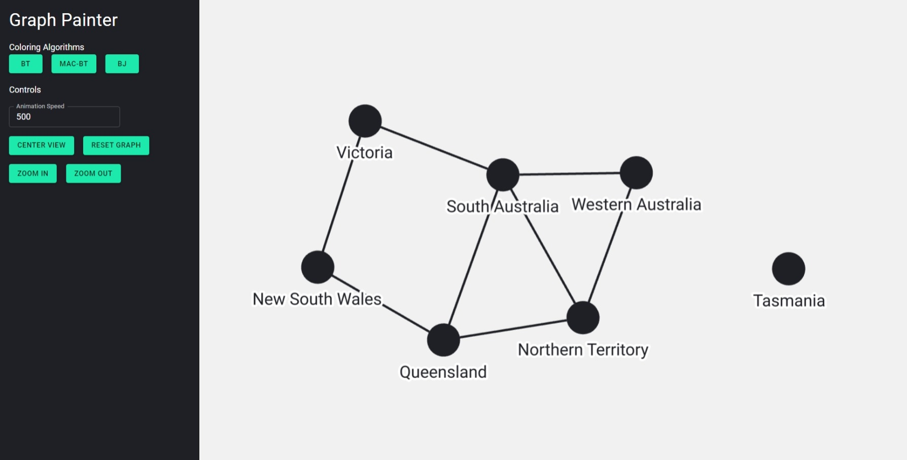
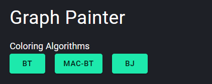
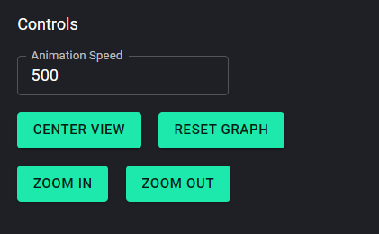
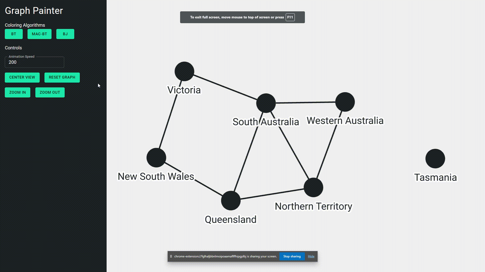
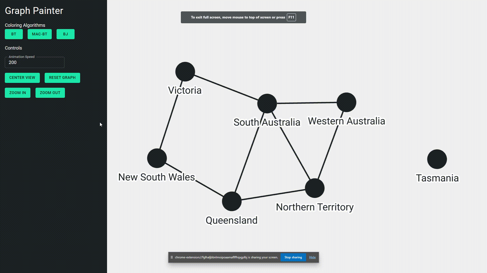

# Australia Graph Coloring

The goal of this project is to implement variations of backtracking based algorithms that assign three colors to every
node of a given graph so that no neighbouring nodes have the same color.

## Installation

The project was written in React.js and Node.js. In order to run the app install nodejs and run the following commands:

* npm install
* npm dev

## Usage

After running the commands a local development server is started on the following address: http://localhost:5173.

The home page shows a canvas with a loaded directed graph and sidebar with control buttons:



The canvas is fully interactive and is draggable and zoomable. In order to start the simulation press one of the three
buttons located under the "Coloring Algorithms section":



To control the animation speed or reset the graph use the buttons under the section "Controls":



## Example

Bellow is a demonstration of the application:


## Solution

### Classic Backtracking

Classic backtracking recursively tries to assign colors to unassigned nodes and check if the partial assignment is valid. The assignment is invalid if there are two neighbouring nodes that have the same color. In such backtrack to the invalid assignment and try a new color.

```js
isGraphValid = (coloring: NodeColor[]): boolean => {
    for (let i = 0; i < this.nodeCnt; i++) {
        for (let j = i + 1; j < this.nodeCnt; j++) {
            // Skip unassigned variables.
            if (coloring[j] === undefined || coloring[i] === undefined) {
                continue;
            }

            if (this.adjacencyMatrix[i][j] && coloring[j] === coloring[i]) {
                return false;
            }
        }
    }
    return true;
}

backtracking = async (
    coloring: NodeColor[] = Array(this.nodeCnt).fill(undefined)
): Promise<boolean> => {
    const unassigned = coloring.indexOf(undefined);
    if (unassigned === -1) {
        return this.isGraphValid(coloring);
    }
    for (let i = 0; i < graphColors.length; i++) {
        await this.colorGraph(coloring, unassigned, graphColors[i]);
        if (this.isGraphValid(coloring) && (await this.backtracking(coloring))) {
            return true;
        }
        await this.colorGraph(coloring, unassigned, undefined);
    }
    return false;
}
```

Here is an example:


### AC-3 Backtracking

In order to prune illegal assignments before they happen, the classical backtracking algorithm is extended with arc consistency check. If arc consistency is not satisfied, return and try a different assignment.

```js
revise = (coloring: NodeColor[], domain: Map<number, string[]>): boolean => {
    // Update the domain of already assigned variables.
    for (let i = 0; i < coloring.length; i++) {
        if (coloring[i] !== undefined) {
            domain.set(i, [coloring[i]!]);
        }
    }

    let stabilized = false;
    // Iterate until domain has not changed.
    while (!stabilized) {
        stabilized = true;
        for (const edge of this.state.edges) {
            const sourceIndex = this.nodeIds.indexOf(edge.source);
            const targetIndex = this.nodeIds.indexOf(edge.target);
            const targetDomain = domain.get(targetIndex)!;
            const updatedSourceDomain = [];
            for (const color of domain.get(sourceIndex)!) {
                if (targetDomain.filter(c => c !== color).length === 0) {
                    stabilized = false;
                } else {
                    updatedSourceDomain.push(color);
                }
            }

            // If domain is empty arc consistency is not satisfied.
            if (updatedSourceDomain.length === 0) {
                return false;
            }
            // Else update domain. 
            else {
                domain.set(sourceIndex, updatedSourceDomain);
            }
        }
    }
    return true;
}

backtrackingAC3 = async (
    coloring: NodeColor[] = Array(this.nodeCnt).fill(undefined),
    domain: Map<number, string[]> = new Map(this.domain),
): Promise<boolean> => {
    const unassigned = coloring.indexOf(undefined);
    if (unassigned === -1) {
        return this.isGraphValid(coloring);
    }
    for (let i = 0; i < graphColors.length; i++) {
        const updatedDomain = new Map(domain);
        await this.colorGraph(coloring, unassigned, graphColors[i]);
        if (this.isGraphValid(coloring) && this.revise(coloring, updatedDomain)) {
            if (await this.backtrackingAC3(coloring, updatedDomain)) {
                return true;
            }
        }
        await this.colorGraph(coloring, unassigned, undefined);
    }
    return false;
}
```

The algorithm runs much faster because the search space is drastically reduced each color assignment:



### Backjumping

Backjumping is an approach is to jump back to the most recent conflict using the idea of conflict sets.

```js
backJumping = async (
    coloring: NodeColor[] = Array(this.nodeCnt).fill(undefined)
): Promise<BackjumpingEvaluation> => {
    const unassigned = coloring.indexOf(undefined);
    let conflictSet = new Set<number>();
    if (unassigned === -1) {
        return new BackjumpingEvaluation(this.isGraphValid(coloring));
    }
    for (let i = 0; i < graphColors.length; i++) {
        let newConflicts: Set<number> = new Set();
        await this.colorGraph(coloring, unassigned, graphColors[i]);
        if (this.isGraphValid(coloring)) {
            const evaluation = await this.backJumping(coloring);
            if (evaluation.isGraphValid) {
                return new BackjumpingEvaluation(true);
            }
            newConflicts = evaluation.conflictSet;
        } else {
            newConflicts.add(unassigned);
            for (const edge of this.state.edges) {
                if (edge.source !== this.nodeIds[unassigned]) {
                    continue;
                }
                const targetIndex = this.nodeIds.indexOf(edge.target);
                if (coloring[unassigned] === coloring[targetIndex]) {
                    newConflicts.add(targetIndex);
                }
            }
        }
        if (!newConflicts.has(unassigned)) {
            return new BackjumpingEvaluation(false, newConflicts);
        } else {
            newConflicts.delete(unassigned);
            conflictSet = new Set([...conflictSet, ...newConflicts]);
            await this.colorGraph(coloring, unassigned, undefined);
        }
    }
    return new BackjumpingEvaluation(false, conflictSet);
}
```

Notice how Tasmania remains unchanged:



